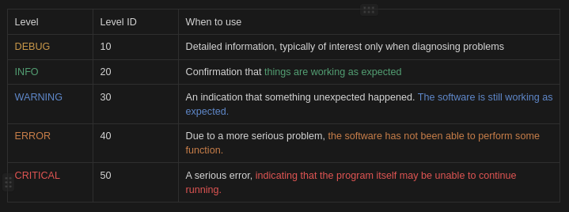

# Logging with Python

## Generic setup
1. Make sure `python-venv` is installed
    ```commandline
    python --version                    # Gets your python version X.Y
    sudo apt install pythonX.Y-venv     # Replace X.Y with your version
    ```

2. Get the repo from `github`
    ```commandline
    cd <your-path>/
    git clone https://github.com/smc40/ksg-logging.git
    cd ksg-logging/
    ```

3. Make and activate `venv`
   ```commandline
   python -m venv venv
   source venv/bin/activate
   ```

## Logging Level


## Default behavior
```commandline
$ python default_logging.py       # Writes the logs in a file 'default_logging.log'
```
---
Under other, withing the `basicConfig` you can specify the logging format
```python
import logging

format = '%(asctime)s - %(name)s - %(levelname)s - %(message)s'
logging.basicConfig(format=format)
```
as well as the [date format](https://www.w3schools.com/python/gloss_python_date_format_codes.asp)
```python
import logging

datefmt = '%a %d %b %Y %H:%M:%S'
logging.basicConfig(datefmt=datefmt)
```
NOTE: The default logging threshold level is set to "WARNING". This means that the logger only logs messages with the
level of WARNING or above (i.e. WARNING, ERROR, CRITICAL). We can set the threshold as follows:
```python
import logging

logging.basicConfig(level='DEBUG')
```
which would cause ALL messages of ANY LEVEL to be logged.

## Handler driven
```commandline
python handler_logging.py       # Writes the logs in a file 'handler_logging.log'
```
---
Let us define two different logging handlers:
1. Logging to a given file (level=WARNING)
2. Logging to the console (level=DEBUG)

For this we use `handlers`
```python
import logging
from pathlib import Path

fmt = logging.Formatter('%(asctime)s - %(name)s - %(levelname)s - %(message)s')

# Logging to file
filename = f'{Path(__file__).stem}.log'
file_handler = logging.FileHandler(filename=filename)
file_handler.setFormatter(fmt=fmt)
file_handler.setLevel(level='WARNING')

# Logging to console
console_handler = logging.StreamHandler()
console_handler.setFormatter(fmt=fmt)
console_handler.setLevel(level='DEBUG')

# Set the basic config for all the subsequent loggers.
logging.basicConfig(level=logging.DEBUG, handlers=[file_handler, console_handler])
```
NOTE: It is crucial to set the level in `logging.basicConfig` to be LOWER or EQUAL to the lowest level of any handler. 
Otherwise, the basic config will reject the log message before sending it to the handlers.

## Multiprocessing
```commandline
python -m pckg.mproc_logging       # Writes the logs in a file 'pckg_logging.log'
```
---
I can not explain it in a better way [here](https://docs.python.org/3/howto/logging-cookbook.html#logging-to-a-single-file-from-multiple-processes)
But mainly logging into a single file from different multiprocessing.Process as we need to “serialize" the access
to a single file across multiple processes. The idea is to set up ONE logger in a listener process to handle log 
writing exclusively, while all other loggers log their messages to a queue that is processed by the listener process.

```python
"""Demonstrates a basic example of logging in multiple processes."""
from pathlib import Path
import logging
import multiprocessing
from random import choice, random
import time

filename = f'{Path(__file__).stem}.log'
fmt = logging.Formatter('%(asctime)s - %(name)s - %(levelname)s - %(message)s')
file_handler = logging.FileHandler(filename=filename)


def listener_configurer():
    root = logging.getLogger()
    fh = logging.FileHandler(filename)
    fh.setFormatter(fmt=fmt)
    root.addHandler(fh)


def listener_process(queue, configurer):
    configurer()
    while True:
        try:
            record = queue.get()
            if record is None:  # We send this as a sentinel to tell the listener to quit.
                break
            logger = logging.getLogger(record.name)
            logger.handle(record)  # No level or filter logic applied - just do it!
        except Exception:
            import sys, traceback
            print('Whoops! Problem:', file=sys.stderr)
            traceback.print_exc(file=sys.stderr)

# Arrays used for random selections in this demo

LEVELS = [logging.DEBUG, logging.INFO, logging.WARNING,
          logging.ERROR, logging.CRITICAL]

LOGGERS = ['a.b.c', 'd.e.f']

MESSAGES = [
    'Random message #1',
    'Random message #2',
    'Random message #3',
]

# The worker configuration is done at the start of the worker process run.
# Note that on Windows you can't rely on fork semantics, so each process
# will run the logging configuration code when it starts.
def worker_configurer(queue):
    h = logging.handlers.QueueHandler(queue)  # Just the one handler needed
    root = logging.getLogger()
    root.addHandler(h)
    # send all messages, for demo; no other level or filter logic applied.
    root.setLevel(logging.DEBUG)

# This is the worker process top-level loop, which just logs ten events with
# random intervening delays before terminating.
# The print messages are just so you know it's doing something!
def worker_process(queue, configurer):
    configurer(queue)
    name = multiprocessing.current_process().name
    print('Worker started: %s' % name)
    for i in range(10):
        time.sleep(random())
        logger = logging.getLogger(choice(LOGGERS))
        level = choice(LEVELS)
        message = choice(MESSAGES)
        logger.log(level, message)
    print('Worker finished: %s' % name)

# Here's where the demo gets orchestrated. Create the queue, create and start
# the listener, create ten workers and start them, wait for them to finish,
# then send a None to the queue to tell the listener to finish.
def main():
    queue = multiprocessing.Queue(-1)
    listener = multiprocessing.Process(target=listener_process,
                                       args=(queue, listener_configurer))
    listener.start()
    workers = []
    for i in range(10):
        worker = multiprocessing.Process(target=worker_process,
                                         args=(queue, worker_configurer))
        workers.append(worker)
        worker.start()
    for w in workers:
        w.join()
    queue.put_nowait(None)
    listener.join()

if __name__ == '__main__':
    main()
```
